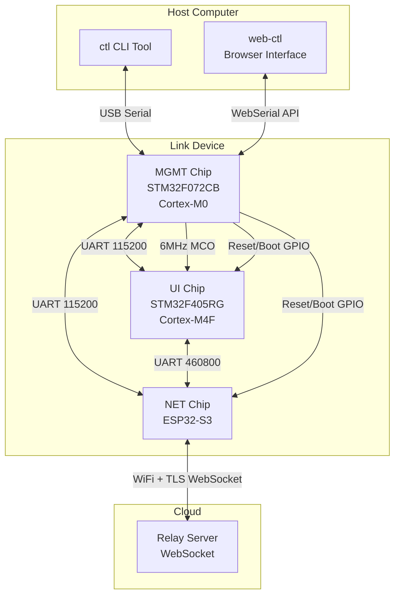
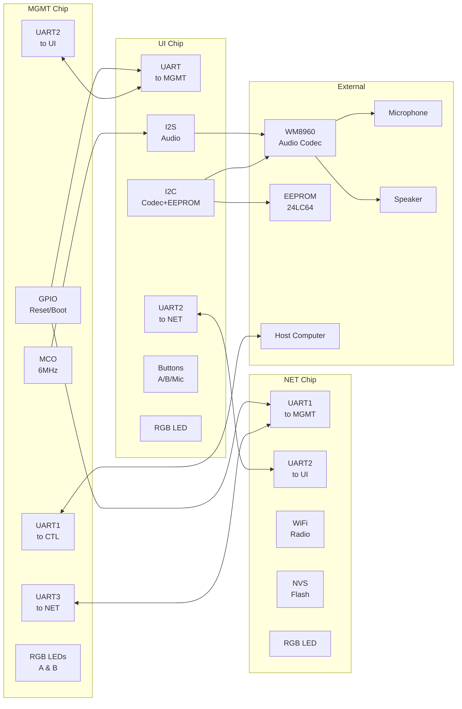
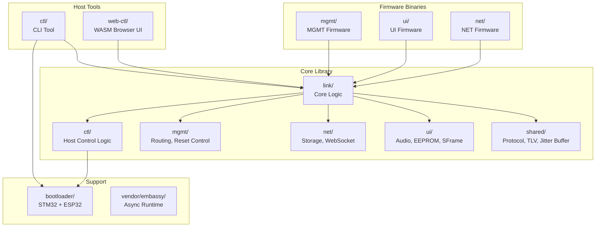
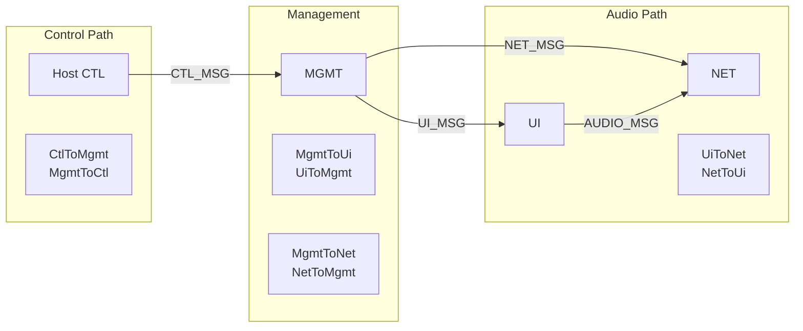
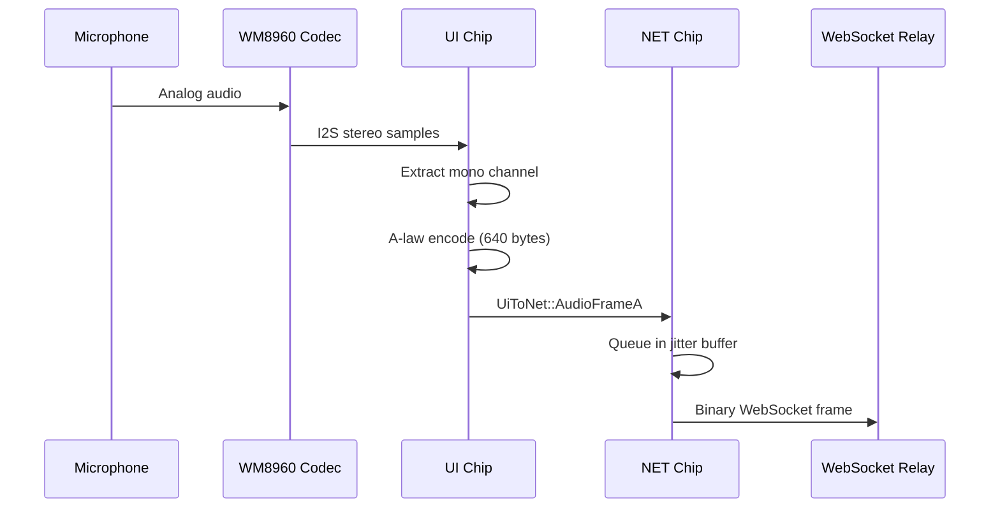
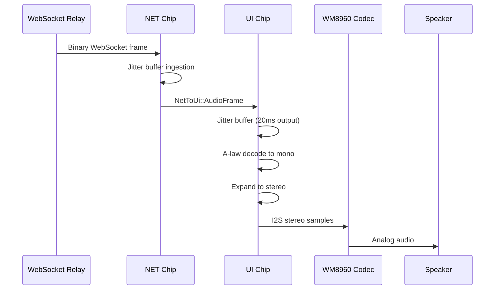
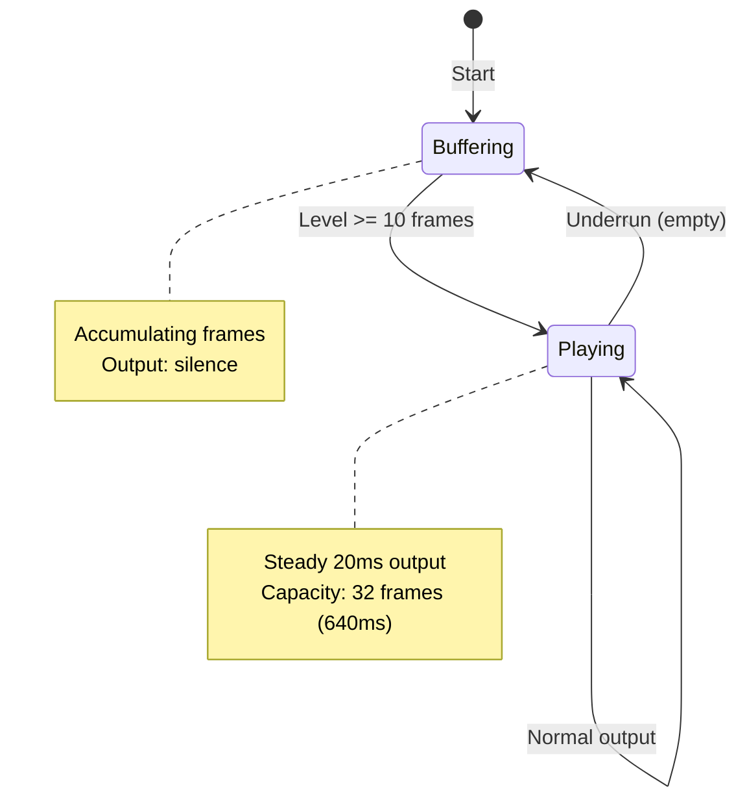
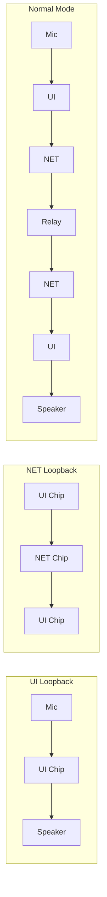
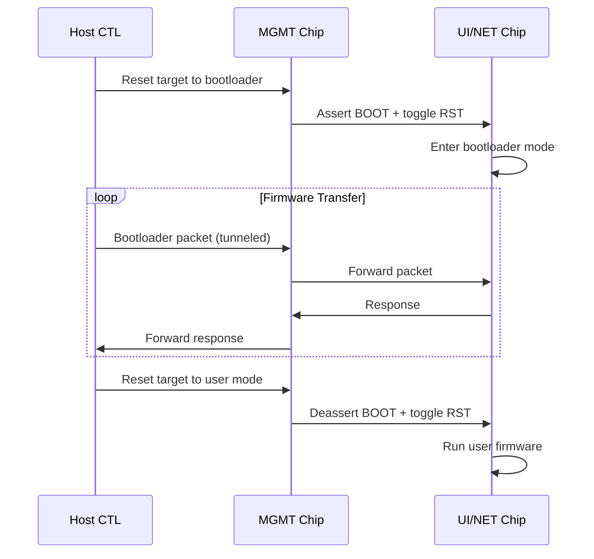
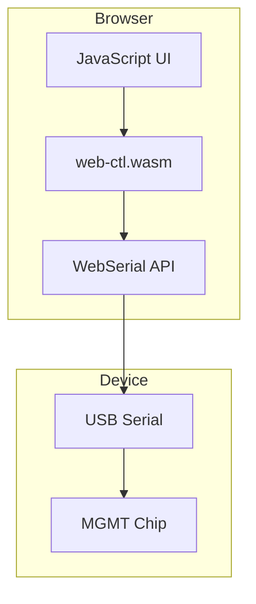

# Link Architecture

This document provides an overview of the Link project architecture, a multi-chip audio communication system designed for secure, real-time audio streaming over the internet.

## System Overview

Link is a hardware device containing three microcontrollers that work together to capture audio, transmit it over a WebSocket connection, and play back received audio. The system is designed for low-latency, encrypted voice communication.



## Hardware Architecture

### Chip Roles

| Chip | MCU | Role | Key Peripherals |
|------|-----|------|-----------------|
| **MGMT** | STM32F072CB (Cortex-M0) | Central orchestrator, message routing | 3x UART, GPIO, MCO clock output |
| **UI** | STM32F405RG (Cortex-M4F) | Audio capture/playback, user input | I2S, I2C (codec + EEPROM), buttons, LED |
| **NET** | ESP32-S3 | Network connectivity | WiFi, NVS flash storage, LED |

### Physical Connections



## Software Architecture

### Crate Structure



### Feature Flags

The `link` crate supports multiple configurations:

| Feature | Purpose |
|---------|---------|
| `defmt` | Logging/debugging output for embedded |
| `trace-tlv` | Verbose TLV message tracing |
| `std` | Enables host-side code (ctl module) |
| `audio-buffer` | Jitter buffering with embassy-time |

## Communication Protocol

### TLV Message Format

All inter-chip communication uses a Type-Length-Value (TLV) protocol with sync word synchronization:

```
┌──────────────┬──────────┬──────────┬─────────────────┐
│  Sync Word   │   Type   │  Length  │      Value      │
│   4 bytes    │  2 bytes │  4 bytes │   0-640 bytes   │
│  0x4C494E4B  │   BE u16 │   BE u32 │    payload      │
│   ("LINK")   │          │          │                 │
└──────────────┴──────────┴──────────┴─────────────────┘
```

The sync word allows receivers to resynchronize after noise or bootloader garbage.

### Message Types



Key message types:

| Direction | Examples |
|-----------|----------|
| CtlToMgmt | Ping, Hello, ResetUi, ResetNet, WsSpeedTest |
| MgmtToUi | Ping, GetVersion, SetSFrameKey, SetLoopback |
| MgmtToNet | AddWifiSsid, SetRelayUrl, WsSend, SetLoopback |
| UiToNet | AudioFrameA, AudioFrameB (640-byte A-law audio) |
| NetToUi | AudioFrame (playback from network) |

## Audio Data Flow

### Audio Format

- **I2S Format**: Stereo 16-bit samples, interleaved L/R
- **Encoded Format**: A-law mono, 640 bytes per frame
- **Frame Rate**: 50 fps (20ms per frame at 32kHz)
- **Codec**: WM8960 (I2C control, I2S data)

### Capture Path (Recording)



### Playback Path (Receiving)



### Jitter Buffer

The jitter buffer absorbs network timing variations to provide smooth playback:



- **Capacity**: 32 frames (~640ms at 20ms/frame)
- **Start Level**: 10 frames (200ms) before playback begins
- **Statistics**: Tracks received, output, underruns, overruns

## Loopback Modes

Both UI and NET chips support loopback modes for testing:



| Mode | Description | Use Case |
|------|-------------|----------|
| UI Loopback | Mic → Speaker (bypasses network) | Test audio hardware |
| NET Loopback | UI → NET → UI (bypasses WebSocket) | Test inter-chip audio path |
| Normal | Full path through WebSocket relay | Production operation |

## Bootloader Architecture

Firmware updates are performed via chip-specific bootloader protocols:



### STM32 Bootloader (MGMT, UI)

- Protocol: USART bootloader (AN3155)
- Commands: Get, Read, Write, Erase, Go
- Parity: Even (required by bootloader)

### ESP32 Bootloader (NET)

- Protocol: ROM bootloader with SLIP framing
- Features: Compression, MD5 verification
- Commands: Sync, Read, Write, Flash data

## Host Control Tools

### CLI Tool (`ctl`)

The `ctl` binary provides command-line access to all device functions:

```
ctl <chip> <command> [args]

Examples:
  ctl ui ping                    # Test UI communication
  ctl ui version                 # Get firmware version
  ctl ui version set 123         # Set firmware version
  ctl ui loopback set true       # Enable UI loopback
  ctl net wifi                   # List WiFi networks
  ctl net wifi add SSID pass     # Add WiFi network
  ctl net relay-url set wss://.. # Set relay URL
  ctl net flash firmware.bin     # Flash NET firmware
```

### Web Interface (`web-ctl`)

A browser-based interface using WebSerial API:



Features:
- Connect/disconnect device
- Read/write all configuration
- Flash firmware with progress
- Auto-populate state on connect

## Persistent Storage

### UI Chip (EEPROM)

| Address | Size | Content |
|---------|------|---------|
| 0x00 | 4 bytes | Firmware version (u32 BE) |
| 0x04 | 16 bytes | SFrame encryption key |

### NET Chip (NVS Flash)

| Key | Content |
|-----|---------|
| `wifi_ssids` | Serialized WiFi credentials (up to 8) |
| `relay_url` | WebSocket relay server URL |

## Security

### SFrame Encryption

Audio frames can be encrypted using the SFrame protocol:
- **Algorithm**: AES-128-GCM
- **Key Derivation**: HKDF-SHA256
- **Key Storage**: UI chip EEPROM
- **Purpose**: End-to-end encryption of audio data

### WebSocket Transport

- **Protocol**: WSS (WebSocket over TLS)
- **Cipher Suite**: TLS 1.2+ with AES-128-GCM-SHA256
- **Authentication**: Server certificate validation

## LED Indicators

| LED | Color | Meaning |
|-----|-------|---------|
| MGMT LED A | Green | MGMT chip healthy |
| MGMT LED A | Red | MGMT chip error |
| MGMT LED B | Blue | NET WiFi connected |
| MGMT LED B | Red | NET WiFi disconnected |
| UI LED | Blue | Audio activity |
| NET LED | Blue | WiFi connected |
| NET LED | Red | WiFi disconnected |

## Build System

### Makefile Targets

```bash
# Flash firmware
make flash-mgmt    # Flash MGMT chip
make flash-ui      # Flash UI chip
make flash-net     # Flash NET chip

# Build web interfaces
make web-ctl       # Build browser control interface
make web-link      # Build virtual device simulator

# Development
make serve-web     # Serve web-ctl locally
make test          # Run all tests
```

### Dependencies

- **Embassy**: Async runtime for embedded Rust
- **esp-rs**: ESP32 Rust ecosystem
- **wasm-pack**: WebAssembly packaging
- **probe-rs**: Flash programming

## Testing

### Unit Tests

```bash
cd link && cargo test --features std
```

Tests cover:
- TLV encoding/decoding
- Jitter buffer behavior
- Audio codec algorithms
- Storage serialization
- GPIO sequences for reset

### Integration Tests

The `testing.rs` module provides end-to-end tests using mock channels:

```rust
#[tokio::test]
async fn ctl_ui_ping() {
    device_test(|mut ctl| async move {
        ctl.ui_ping(b"hello").await;
    }).await;
}
```

## Future Considerations

- **Multiple Relay Servers**: Failover and load balancing
- **Peer-to-Peer**: Direct device-to-device communication
- **Audio Processing**: Noise cancellation, echo suppression
- **Battery Management**: Power optimization for portable use
